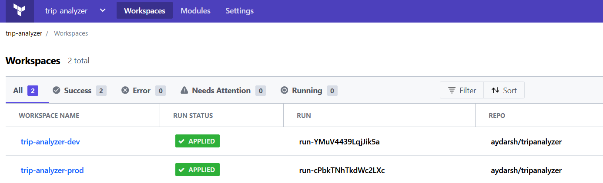
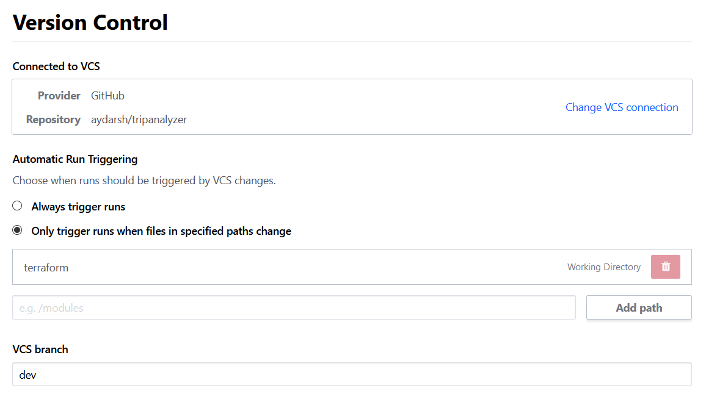
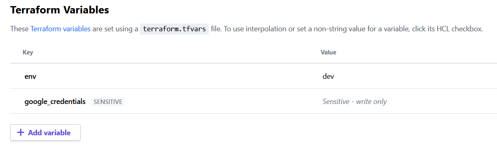
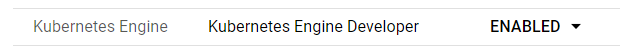

# Vehicle Trip Analyzer  

## Task definition
* Implement the [specified](task-swagger.yml) REST Endpoint
* Protect the API with BasicAuth
* Use Docker to run your application
* Use one of the following languages: Go, Java, Python, C++
* Automate the infrastructure rollout
* Use an external service to determine the city name for depature and destination
* Upload your solution to a private GitHub repository
* Provide a link to the secured hosted instance of your solution
* Provide the following files together with your code:
  - Dockerfile
  - Build-Script
  - Deployment-Script
  - Kubernetes deployment YAML (if Kubernetes is used)
  - Infrastructure automation scripts
  - README.md with documentation how to deploy the infrastructure and the application

---

Create a fork of the [tripanalyzer](https://github.com/aydarsh/tripanalyzer) repository to your account.  

## Configuring Terraform  
I used [Terraform Cloud](https://app.terraform.io) to automate infrastructure management. In fact, the infrastructure can be deployed by issuing terraform commands from the [terraform/](terraform/) directory. However, I would like to give instructions on how to configure Terraform Cloud.  

Firstly, sign up and create a Terraform Cloud account. Create an organization named `trip-analyzer` and two workspaces: `trip-analyzer-dev` and `trip-analyzer-prod`. These workspaces are for dev and prod environment infrastructure resources:    


Then, connect workspaces to your GitHub repository. Choose option **Only trigger runs when files in specified paths change** and enter `terraform` in the input field. For **VCS branch** enter `dev`:
  

After that, configure variables for your workspaces. Add variable `env` with value `dev`. I used Google Cloud Platform for the infrastructure, that is why I need Google credentials. In the next step I will explain how to add `google_credentials` variable. Do not add it now:


## Configuring Google credentials  

Go to **Google Cloud [web console](https://console.cloud.google.com/)** -> **IAM & Admin** -> **Service Accounts** -> **Create Service Account**. Name it as `trip-analyzer-dev` and press **Create**. Then **Select Role** -> **Editor** -> **Continue** -> **Create Key** -> **Create**. Download the json file. Open this file in Notepad++, select all text and go to **Plugins** -> **MIME Tools** -> **Base64 Encode**. We will add this to Terraform now. Open `trip-analyzer-dev` workspace, go to **Variables** tab and press **Add variable**. For the **Key** field enter `google_credentials`, for the **Value** paste the Base64 encoded content from Notepad++, the **Sensitive** checkbox and press **Save variable**.  

Create `trip-analyzer-prod` service account, select `Editor` role and create a key for that account. In the variables section of the `trip-analyzer-prod` workspace create `env` variable with value `prod` and `google_credentials` sensitive variable with the Base64 encoded key file contents.   

With this configuration when you change files in the `terraform/` directory and push it to the `dev` branch `trip-analyzer-dev` infrastructure will be changed. Similarly, when files in the `terraform/` directory change for the `master` branch `trip-analyzer-prod` infrastructure will be changed.  

Now go to the **Google Cloud web console** -> **APIs & Services** -> **Enable APIs & Services**, enter `Kubernetes` in the search field, press `Kubernetes Engine API` and then **Enable**. Also enable the following APIs:  
* `Cloud Resource Manager API`
* `Geocoding API`
* `Cloud Build API`

## Configuring Kubernetes secrets

So far, so good. Now we will configure `Geocoding API` and `Basic Auth` credentials to use in our Kubernetes clusters. We will get Google Geocoding API key, then start Terraform pipelines to create `trip-analyzer-dev` and `trip-analyzer-prod` kubernetes clusters, use `kubectl` command to create corresponding secrets.  
  
Now go to the **Google Cloud web console** -> **APIs & Services** -> **Credentials**. In the **API Keys** section find your key, it looks like `AIzaSyCEAq..`, and press a button next to it to copy. Store this value in Notepad++, we will use it in the next step.  

Go to the Terraform Cloud console, then to the `trip-analyzer` organisation and click `trip-analyzer-dev` workspace. Press **Queue plan** dropdown box and then **Queue plan** button. This will start infrastructure build pipeline. Have a look at planned changes and then press **Confirm** to complete infrastructure build.  

Switch to the **Google Cloud web console** -> **Kubernetes Engine**. On this page you can see the `trip-analyzer-dev` and `trip-analyzer-prod` clusters. Once they are ready press **Connect** button, then **Run in Cloud Shell**. Substitute API key value for `<APIkey>` and your password for `<password>` in the following commands and run them:  
```commandline
kubectl create secret generic geocodingkey --from-literal=APIKEY=<APIkey>
kubectl create secret generic basicauthkey --from-literal=BASICAUTHKEY=<password>
``` 
Do the same steps for the `trip-analyzer-prod` cluster with different values for `<APIkey>` and `<password>`.  

## Configuring CI/CD
I configured CI/CD by means of Google Cloud Build in [GitOps style](https://cloud.google.com/kubernetes-engine/docs/tutorials/gitops-cloud-build).  

To setup CI/CD pipelines go to the **Google Cloud web console** -> **Cloud Build** -> **Triggers**. Press **Connect repository**, select `GitHub (Cloud Build GitHub App)` and then click **Continue**. Add your GitHub account, select your `tripanalyzer` repository, check the `I understand that GitHub content...` checkbox and **Connect repository** button. Now go to the **Triggers** page and click **Create trigger**. Use the following values to configure the trigger:  

| **Parameter** | **Value** |
| --- | --- |
| Name | push-trigger-app |
| Event | Push to a branch |
| Branch | ^dev$ |
| Included files filter (glob) | Dockerfile, src/\*\*, cloudbuild.yaml |
| Ignored files filter (glob) | terraform/\*\*, env/\*\* |
| File type | Cloud Build configuration file (yaml or json) |
| Cloud Build configuration file location | cloudbuild.yaml |  

Press **Save** button. Add new trigger with the following values:  

| **Parameter** | **Value** |
| --- | --- |
| Name | push-trigger-env |
| Event | Push to a branch |
| Branch | ^dev$ |
| Included files filter (glob) | env/\*\* |
| Ignored files filter (glob) | terraform/\*\*, src/\*\* |
| File type | Cloud Build configuration file (yaml or json) |
| Cloud Build configuration file location | env/cloud-delivery.yaml |

**Add variable**

| **Variable** | **Value** |
| --- | --- |
| _ENV | dev |

Press **Save** button.

Now go to the **Settings** page and enable `Kubernetes Engine Developer` role for the Cloud Build service account:  
  
After that go to the **Google Cloud web console** -> **IAM & Admin**. Find member email that ends with `@cloudbuild.gserviceaccount.com` and click pen button to edit its permissions. Press **Add another role**, type `secret` and select `Secret Manager Secret Accessor`, press **Save**.  

Go to the **Google Cloud web console** -> **Secret Manager** -> **Create secret**. Name new secret as `github_key`, press **Browse** and select your GitHub deploy key.  

Good. Now one more step before running examples. Open `clounbuild.yaml` file and substitute your values in the following lines:
```commandline
git clone git@github.com:aydarsh/tripanalyzer.git
git config user.email aydarsh@gmail.com 
```
Also edit `env/cloud-delivery.yaml` file with your values.  

## Testing the application

Example files are in the [`examples/`](examples/) directory. Use either **Postman**, **VSCode REST Client Extension** or `curl` command to send a `POST` request to the `trip-analyzer-dev` LoadBalancer endpoint data from these files. Do not forget to set Basic Auth credentials before you send the request. Username is `admin` and password is `<password>`, that is the value you set in the **Configuring Kubernetes secrets** step. 